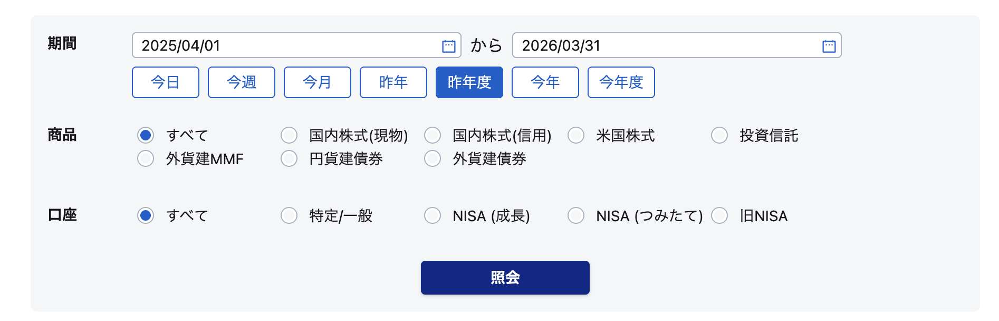

# SBI証券 ウェブ拡張ツール

SBI証券（[site.sbisec.co.jp](https://site.sbisec.co.jp)）に便利機能を追加するChrome拡張です。

## インストール

1. このリポジトリをクローンまたはZIPでダウンロード
2. Chrome で `chrome://extensions/` を開く
3. 右上の「デベロッパーモード」をオン
4. 「パッケージ化されていない拡張機能を読み込む」でフォルダを選択

## 機能

### 日付ショートカットボタン

**対象ページ**: 実現損益詳細・配当金

期間検索エリアに年度・年単位のショートカットボタンを追加します。確定申告や運用レビューで使いやすい期間をワンクリックで設定できます。

追加されるボタン:

| ボタン | 開始日 | 終了日 |
|--------|--------|--------|
| 昨年 | 前年 1/1 | 前年 12/31 |
| 昨年度 | 前年度 4/1 | 前年度 3/31 |
| 今年度 | 今年度 4/1 | 本日 |
